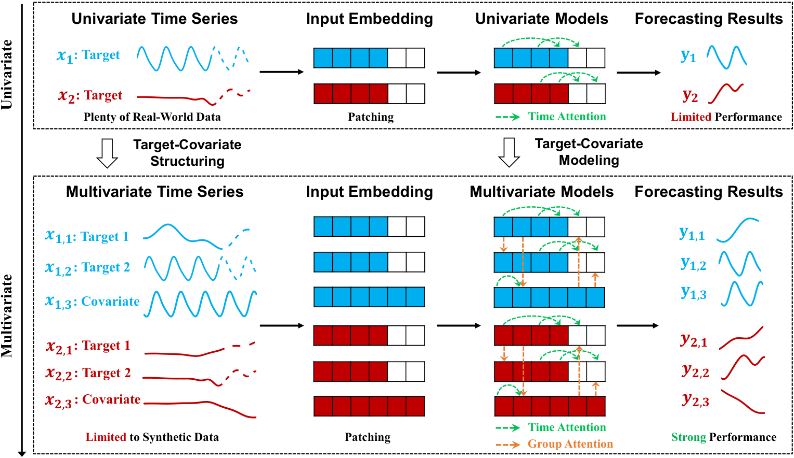
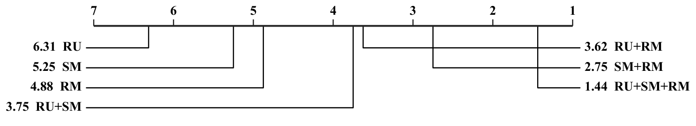
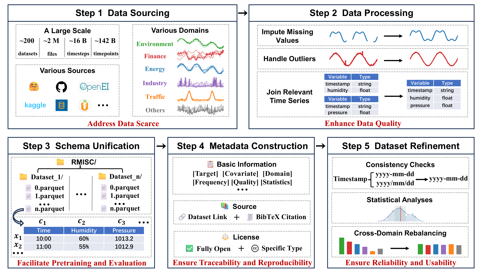

# RMISC: A Large-scale Real-world Multivariate Corpus for Time Series Foundation Models

**RMISC** is a large-scale, real-world multivariate time-series corpus built for pretraining and benchmarking **multivariate** time-series foundation models (**TSFMs**). It consists of aound 200 datasets, 2 million time-series files, 16 billion timesteps, and 142 billion time points from diverse real-world domains. Experimental results show that incorporating RMISC into training data improves the generalization performance for state-of-the-art TSFMs, providing a deeper understanding of how real-world multivariate data contributes to the development of stronger TSFMs.

[Read the paper](./RMISC_A_Large-scale_Real-world_Multivariate_Corpus_for_Time_Series_Foundation_Models.pdf)


## Why Real-World Multivariate Data?

Real-world forecasting tasks rarely consist of isolated variables. Targets are usually influenced by related measurements, known future inputs, and other covariates. Capturing the cross-variable information is one of the fundamental topics in the development of TSFMs, the modeling workflow of which is illustrated in the figure below. 

<p align="center">
  
</p>

Modern multivariate TSFMs are predominantly pretrained on multivariate synthetic data, which is easier to scale but may fail to capture the complex temporal dynamics and cross-variable relationships present in real-world time series. This raises a key question: Whether and to what extent the leading TSFMs trained with the real-world corpus perform better than those trained with synthetic data? To answer this, we establish the RMISC corpus, a considerably large-scale, high-quality, openly accessible, real-world, and multivariate time series archive that contains around 200 datasets and 142 billion time points across diverse domains.

In our experiments, we compare three pretraining corpus types:

- **RU:** Real-world univariate data.
- **SM:** Synthetic multivariate data.
- **RM:** Real-world multivariate data from RMISC.

Four representative TSFMs (Chronos-2, GTT, Moirai-2.0, TimesFM-2.5) are pretrained on all non-empty combinations of RU, SM, and RM, then evaluated on held-out in-distribution data and the GIFT-Eval and fev-bench out-of-distribution benchmarks.

The figure below reports the average ranks of seven corpora, where a lower rank indicates better forecasting performance.

<p align="center">
  
</p>

It can be observed that:
- The RU corpus consistently ranks last among all training corpora, indicating that univariate data is less effective for pretraining TSFMs compared to multivariate data.

- The top three performing training corpora all include the RM corpus, highlighting its consistent positive contribution. Also, the RM corpus consistently outperforms the SM corpus across both single-source and two-source pretraining settings, showing a clear advantage of real-world multivariate data over synthetic multivariate data.

- The full combination RU+SM+RM achieves the best overall average rank among all configurations, which we recommend as the preferred pretraining corpus for building stronger multivariate TSFMs.


## Overview
A compact summary of RMISC datasets. “Obs.” is the total count of time points.

<details>
<summary>Show full dataset table</summary>

| Dataset | Domain | Dimension | Obs. |
|---|---|---:|---:|
| [ACSF1](<https://www.timeseriesclassification.com/description.php?Dataset=ACSF1>) | Energy | 1 | 0.29 M |
| [ApplianceEnergy](<https://archive.ics.uci.edu/dataset/374/appliances+energy+prediction>) | Energy | 26 | 0.51 M |
| [AustralianElectricityDemand](<https://zenodo.org/records/4659727>) | Energy | 5 | 1.15 M |
| [AzurePublicDatasetV1](<https://github.com/Azure/AzurePublicDataset>) | Energy | 3 | 3060.08 M |
| [AzurePublicDatasetV2](<https://github.com/Azure/AzurePublicDataset>) | Energy | 3 | 4968.71 M |
| [BatteryRUL](<https://www.kaggle.com/datasets/ignaciovinuales/battery-remaining-useful-life-rul>) | Energy | 9 | 0.14 M |
| [BDG2-Bear](<https://huggingface.co/datasets/Maple728/Time-300B/tree/main/energy/bdg-2_bear>) | Energy | 1 | 1.42 M |
| [BDG2-Fox](<https://huggingface.co/datasets/Maple728/Time-300B/tree/main/energy/bdg-2_fox>) | Energy | 1 | 2.29 M |
| [BDG2-Panther](<https://huggingface.co/datasets/Maple728/Time-300B/tree/main/energy/bdg-2_panther>) | Energy | 1 | 0.89 M |
| [BDG2-Rat](<https://huggingface.co/datasets/Maple728/Time-300B/tree/main/energy/bdg-2_rat>) | Energy | 1 | 4.60 M |
| [BritainCoal](<https://data.world/makeovermonday/2019w32>) | Energy | 10 | 7.96 M |
| [BuildingsBenchComAmy](<https://data.openei.org/s3_viewer?bucket=oedi-data-lake&prefix=buildings-bench%2F>) | Energy | 148 | 3040.60 M |
| [BuildingsBenchComTmy](<https://data.openei.org/s3_viewer?bucket=oedi-data-lake&prefix=buildings-bench%2F>) | Energy | 147 | 3026.98 M |
| [BuildingsBenchRealCSV](<https://data.openei.org/s3_viewer?bucket=oedi-data-lake&prefix=buildings-bench%2F>) | Energy | 2 | 39.64 M |
| [BuildingsBenchResAmy](<https://data.openei.org/submissions/5859>) | Energy | 235 | 4815.70 M |
| [BuildingsBenchResTmy](<https://data.openei.org/submissions/5859>) | Energy | 235 | 4815.72 M |
| [Bull](<https://huggingface.co/datasets/Maple728/Time-300B/tree/main/energy/bull>) | Energy | 1 | 0.50 M |
| [Computers](<https://www.timeseriesclassification.com/description.php?Dataset=Computers>) | Energy | 1 | 0.36 M |
| [Electricity](<https://archive.ics.uci.edu/dataset/321/electricityloaddiagrams20112014>) | Energy | 321 | 8.44 M |
| [ElectricityHourly](<https://zenodo.org/records/4656140>) | Energy | 321 | 8.44 M |
| [ERCOT](<https://www.ercot.com/gridinfo/load/load_hist>) | Energy | 8 | 1.39 M |
| [ETT](<https://github.com/zhouhaoyi/ETDataset>) | Energy | 7 | 1.22 M |
| [ETTMulti](<https://github.com/zhouhaoyi/ETDataset>) | Energy | 7 | 1.22 M |
| [GFC2012](<https://huggingface.co/datasets/Maple728/Time-300B/tree/main/energy/gfc12_load>) | Energy | 1 | 0.50 M |
| [Hog](<https://huggingface.co/datasets/Maple728/Time-300B/tree/main/energy/hog>) | Energy | 1 | 0.37 M |
| [HouseholdPower](<https://archive.ics.uci.edu/dataset/235/individual+household+electric+power+consumption>) | Energy | 7 | 14.53 M |
| [Ideal](<https://huggingface.co/datasets/Maple728/Time-300B/tree/main/energy/ideal>) | Energy | 1 | 1.25 M |
| [LondonSmartMeters](<https://zenodo.org/records/4656072>) | Energy | 1 | 71.93 M |
| [OilWell](<https://www.kaggle.com/datasets/afrniomelo/3w-dataset>) | Energy | 5 | 244.53 M |
| [OPSD](<https://data.open-power-system-data.org/>) | Energy | 8 | 22.90 M |
| [OPSD-Household](<https://data.open-power-system-data.org/household_data/2020-04-15>) | Energy | 7 | 47.88 M |
| [OPSD-PV-Wind](<https://data.open-power-system-data.org/ninja_pv_wind_profiles/2020-09-16>) | Energy | 4 | 48.74 M |
| [OPSD-When2Heat](<https://data.open-power-system-data.org/when2heat/2023-07-27>) | Energy | 22 | 45.61 M |
| [Pvdaq](<https://data.openei.org/s3_viewer?bucket=oedi-data-lake&prefix=pvdaq%2F>) | Energy | 2 | 8.21 M |
| [ResidentialPower](<https://zenodo.org/records/8219786>) | Energy | 2 | 525.09 M |
| [ShellHackathon](<https://www.kaggle.com/datasets/dilipkola/shell-ai-solar-irradiance-prediction-hackathon>) | Energy | 15 | 7.91 M |
| [Solar10Minutes](<https://zenodo.org/records/4656144>) | Energy | 137 | 7.20 M |
| [Solar4Seconds](<https://zenodo.org/records/4656027>) | Energy | 1 | 7.40 M |
| [SolarEnergy](<https://github.com/laiguokun/multivariate-time-series-data>) | Energy | 137 | 7.20 M |
| [TetuanPowerConsumption](<https://archive.ics.uci.edu/dataset/849/power+consumption+of+tetouan+city>) | Energy | 8 | 0.42 M |
| [UK-DALE](<https://jack-kelly.com/data/>) | Energy | 2 | 65.60 M |
| [WindElec](<https://www.dcic-china.com/competitions/10098/datasets>) | Energy | 13 | 3.01 M |
| [WindFarms](<https://zenodo.org/records/4654858>) | Energy | 295 | 19.26 M |
| [WindPower4secs](<https://zenodo.org/records/4656032>) | Energy | 1 | 7.40 M |
| [BeijingAirQuality](<https://archive.ics.uci.edu/dataset/501/beijing+multi+site+air+quality+data>) | Environment | 8 | 3.16 M |
| [BeutenbergWeather](<https://www.kaggle.com/datasets/mnassrib/jena-weather-dataset>) | Environment | 20 | 17.88 M |
| [CMIP6-2000-PartI](<https://huggingface.co/datasets/Maple728/Time-300B/tree/main/nature/cmip6_2000>) | Environment | 1 | 1056.50 M |
| [CMIP6-2000-PartII](<https://huggingface.co/datasets/Maple728/Time-300B/tree/main/nature/cmip6_2000>) | Environment | 1 | 1056.50 M |
| [CMIP6-2000-PartIII](<https://huggingface.co/datasets/Maple728/Time-300B/tree/main/nature/cmip6_2000>) | Environment | 1 | 1056.49 M |
| [CMIP6-2005-PartI](<https://huggingface.co/datasets/Maple728/Time-300B/tree/main/nature/cmip6_2000>) | Environment | 1 | 1056.50 M |
| [CMIP6-2005-PartII](<https://huggingface.co/datasets/Maple728/Time-300B/tree/main/nature/cmip6_2000>) | Environment | 1 | 1056.50 M |
| [CMIP6-2005-PartIII](<https://huggingface.co/datasets/Maple728/Time-300B/tree/main/nature/cmip6_2000>) | Environment | 1 | 1056.49 M |
| [CMIP6-2010-PartI](<https://huggingface.co/datasets/Maple728/Time-300B/tree/main/nature/cmip6_2000>) | Environment | 1 | 1056.50 M |
| [CMIP6-2010-PartII](<https://huggingface.co/datasets/Maple728/Time-300B/tree/main/nature/cmip6_2000>) | Environment | 1 | 1056.50 M |
| [CMIP6-2010-PartIII](<https://huggingface.co/datasets/Maple728/Time-300B/tree/main/nature/cmip6_2000>) | Environment | 1 | 1056.49 M |
| [ERA5HourlySingleLevels](<https://cds.climate.copernicus.eu/datasets/reanalysis-era5-single-levels-timeseries?tab=overview>) | Environment | 15 | 462.92 M |
| [GasSensorTemperature](<https://archive.ics.uci.edu/dataset/487/gas+sensor+array+temperature+modulation>) | Environment | 20 | 76.86 M |
| [GlobalClimateChange](<https://data.world/data-society/global-climate-change-data>) | Environment | 2 | 5.63 M |
| [KDDCup2018](<https://zenodo.org/records/4656719>) | Environment | 50 | 0.54 M |
| [OikolabWeather](<https://zenodo.org/records/5184708>) | Environment | 8 | 0.80 M |
| [PM25FiveCities](<https://archive.ics.uci.edu/dataset/394/pm2+5+data+of+five+chinese+cities>) | Environment | 10 | 1.15 M |
| [Subseasonal](<https://github.com/microsoft/subseasonal_data>) | Environment | 60 | 5668.67 M |
| [TemperatureRain](<https://zenodo.org/records/5129091>) | Environment | 1614 | 1.17 M |
| [Tigge](<https://github.com/pangeo-data/WeatherBench>) | Environment | 194 | 21.01 M |
| [USAirPollution](<https://data.world/data-society/us-air-pollution-data>) | Environment | 14 | 24.45 M |
| [Weather](<https://zenodo.org/records/4654822>) | Environment | 1 | 14.72 M |
| [WeatherBench5-625deg](<https://github.com/pangeo-data/WeatherBench>) | Environment | 61 | 43783.91 M |
| [WeatherTest](<https://www.bgc-jena.mpg.de/wetter/>) | Environment | 21 | 1.11 M |
| [XiamenAirQuality](<https://challenge.datacastle.cn/v3/cmptDetail.html?id=950>) | Environment | 6 | 9.10 M |
| [AliCar](<https://tianchi.aliyun.com/competition/entrance/231641/information>) | Finance | 2 | 0.01 M |
| [AMarketChina](<https://github.com/BUAA-WJR/PriceGraph>) | Finance | 6 | 3.71 M |
| [AMarketChinaKnownOpen](<https://github.com/BUAA-WJR/PriceGraph>) | Finance | 6 | 3.71 M |
| [Bitcoin](<https://www.kaggle.com/datasets/jkraak/bitcoin-price-dataset>) | Finance | 645 | 2.83 M |
| [Bizitobs_application](<https://huggingface.co/spaces/Salesforce/GIFT-Eval>) | Finance | 1 | 0.02 M |
| [Bizitobs_l2c_H](<https://huggingface.co/spaces/Salesforce/GIFT-Eval>) | Finance | 1 | 0.02 M |
| [CausalEffects](<https://data.world/data-society/causal-effects-in-time-series>) | Finance | 100 | 0.11 M |
| [ChinaMinuteStock](<https://huggingface.co/datasets/perctrix/StockChina-Minute>) | Finance | 13 | 6480.79 M |
| [Cif2016-12](<https://huggingface.co/datasets/Maple728/Time-300B/tree/main/finance/cif_2016_12>) | Finance | 1 | 0.006 M |
| [Cif2016-6](<https://huggingface.co/datasets/Maple728/Time-300B/tree/main/finance/cif_2016_6>) | Finance | 1 | 0.0006 M |
| [Cryptocurrency](<https://www.kaggle.com/competitions/g-research-crypto-forecasting/data>) | Finance | 5 | 9.87 M |
| [CryptocurrencyKnownOpen](<https://www.kaggle.com/competitions/g-research-crypto-forecasting/data>) | Finance | 5 | 9.87 M |
| [CSI500](<https://www.csindex.com.cn/#/indices/family/detail?indexCode=000500>) | Finance | 7 | 643.70 M |
| [Dominick](<https://zenodo.org/records/4654802>) | Finance | 1298 | 0.51 M |
| [ExchangeRate](<https://github.com/laiguokun/multivariate-time-series-data>) | Finance | 8 | 0.06 M |
| [FavoritaSales](<https://www.kaggle.com/c/favorita-grocery-sales-forecasting/data>) | Finance | 28 | 448.49 M |
| [FavoritaTransactions](<https://www.kaggle.com/c/favorita-grocery-sales-forecasting/data>) | Finance | 3 | 0.25 M |
| [FavoritaTransactionsKnownOil](<https://www.kaggle.com/c/favorita-grocery-sales-forecasting/data>) | Finance | 3 | 0.25 M |
| [FredMD](<https://zenodo.org/records/4654833>) | Finance | 110 | 0.08 M |
| [HierachicalSales](<https://data.mendeley.com/datasets/s8dgbs3rng/1>) | Finance | 234 | 0.42 M |
| [KaggleTS](<https://www.kaggle.com/datasets/jayantiprasad/time-series-datasets>) | Finance | 6 | 0.05 M |
| [M5](<https://www.kaggle.com/c/m5-forecasting-accuracy/overview>) | Finance | 318 | 116.21 M |
| [NIFTYStock](<https://www.kaggle.com/datasets/rohanrao/nifty50-stock-market-data>) | Finance | 9 | 4.24 M |
| [NIFTYStockKnownOpen](<https://www.kaggle.com/datasets/rohanrao/nifty50-stock-market-data>) | Finance | 9 | 4.24 M |
| [NN5Daily](<https://zenodo.org/records/4656110>) | Finance | 114 | 0.09 M |
| [Restaurant](<https://huggingface.co/datasets/Maple728/Time-300B/tree/main/sales/restaurant>) | Finance | 1 | 0.03 M |
| [Rohlik_orders_1D](<https://huggingface.co/spaces/autogluon/fev-bench>) | Finance | 7 | 0.01 M |
| [Rohlik_orders_1W](<https://huggingface.co/spaces/autogluon/fev-bench>) | Finance | 7 | 0.00 M |
| [Rossmann_1D](<https://huggingface.co/spaces/autogluon/fev-bench>) | Finance | 1115 | 1.05 M |
| [Rossmann_1W](<https://huggingface.co/spaces/autogluon/fev-bench>) | Finance | 1115 | 0.15 M |
| [SP500](<https://github.com/liorsidi/sp500-stock-similarity-time-series/tree/master>) | Finance | 5 | 3.01 M |
| [SP500KnownOpen](<https://github.com/liorsidi/sp500-stock-similarity-time-series/tree/master>) | Finance | 5 | 3.01 M |
| [StockFactorsCleaned](<https://huggingface.co/datasets/MMInstruction/stock_factors/tree/main>) | Finance | 70 | 1133.71 M |
| [StockMarketData](<https://www.kaggle.com/datasets/paultimothymooney/stock-market-data>) | Finance | 70 | 0.69 M |
| [TourismMonthly](<https://huggingface.co/datasets/Maple728/Time-300B/tree/main/finance/tourism_monthly>) | Finance | 1 | 0.10 M |
| [TushareETFDaily](<https://tushare.pro/document/2?doc_id=127>) | Finance | 10 | 24.36 M |
| [TushareIndexDaily](<https://tushare.pro/document/2?doc_id=95>) | Finance | 11 | 26.40 M |
| [TushareStockDaily](<https://tushare.pro/document/2?doc_id=27>) | Finance | 11 | 155.79 M |
| [TushareStockDailyMetrics](<https://tushare.pro/document/2?doc_id=32>) | Finance | 14 | 196.43 M |
| [TushareStockWeekly](<https://tushare.pro/document/2?doc_id=144>) | Finance | 11 | 32.64 M |
| [UKEconomy](<https://data.world/ian/3-centuries-of-uk-economy-data>) | Finance | 1 | 0.40 M |
| [WeeklyFuelPricesItaly](<https://data.world/rafabelokurows/weekly-fuel-prices-in-italy>) | Finance | 4 | 0.02 M |
| [WeeklyRoadFuelPrices](<https://data.world/makeovermonday/2020w17-weekly-road-fuel-prices>) | Finance | 2 | 0.002 M |
| [Behavior-1k](<https://huggingface.co/datasets/behavior-1k/2025-challenge-demos>) | Industry | 446 | 37682.52 M |
| [BTS](<https://github.com/cruiseresearchgroup/DIEF_BTS>) | Industry | 1495 | 95.87 M |
| [FrothFlotation](<https://www.kaggle.com/datasets/veeralakrishna/froth-flotation>) | Industry | 12 | 0.04 M |
| [GasPipeline](<https://sites.google.com/a/uah.edu/tommy-morris-uah/ics-data-sets>) | Industry | 10 | 1.38 M |
| [GasSensorDynamic](<https://archive.ics.uci.edu/dataset/322/gas+sensor+array+under+dynamic+gas+mixtures>) | Industry | 18 | 37.75 M |
| [LBNL](<https://datadryad.org/stash/dataset/doi:10.7941/D1N33Q#citations>) | Industry | 61 | 122.27 M |
| [OccupancyDetection](<https://archive.ics.uci.edu/dataset/357/occupancy+detection>) | Industry | 6 | 0.12 M |
| [ProEnFo](<https://github.com/Leo-VK/EnFoAV>) | Industry | 23 | 5.31 M |
| [PUMP](<https://www.kaggle.com/datasets/nphantawee/pump-sensor-data>) | Industry | 44 | 9.69 M |
| [RoomOccupancy](<https://archive.ics.uci.edu/dataset/864/room+occupancy+estimation>) | Industry | 17 | 0.17 M |
| [ServerMachineDataset](<https://github.com/NetManAIOps/OmniAnomaly>) | Industry | 31 | 21.99 M |
| [SmellSensor](<https://huggingface.co/datasets/JayGajera/TimeSeriesSmellSensorDataForClassification>) | Industry | 19 | 402.56 M |
| [SWAT](<https://www.kaggle.com/datasets/abdullahk1h2a3n/swatdataset/data>) | Industry | 42 | 7.93 M |
| [WADI](<https://www.kaggle.com/datasets/giovannimonco/wadi-data>) | Industry | 93 | 23.96 M |
| [BeijingSubway](<https://github.com/JinleiZhangBJTU/ResNet-LSTM-GCN>) | Traffic | 276 | 2.98 M |
| [ChengduTaxi](<https://github.com/UrbComp/DeepTTE>) | Traffic | 4 | 2.85 M |
| [LoopSeattleLA](<https://github.com/LibCity/Bigscity-LibCity-Datasets>) | Traffic | 258 | 15.89 M |
| [Mdense](<https://github.com/rdemedrano/crann_traffic/tree/master>) | Traffic | 1 | 0.02 M |
| [Metropt3](<https://archive.ics.uci.edu/dataset/791/metropt+3+dataset>) | Traffic | 15 | 15.73 M |
| [MetroTraffic](<https://archive.ics.uci.edu/dataset/492/metro+interstate+traffic+volume>) | Traffic | 5 | 0.24 M |
| [PEMS-Bay-METRO-LA](<https://github.com/liyaguang/DCRNN>) | Traffic | 278 | 24.03 M |
| [PEMSCalifornia](<https://github.com/LibCity/Bigscity-LibCity-Datasets>) | Traffic | 361 | 38.22 M |
| [QtrafficSpeed](<https://github.com/JingqingZ/BaiduTraffic?tab=readme-ov-file>) | Traffic | 2 | 528.77 M |
| [Rideshare](<https://zenodo.org/records/5122232>) | Traffic | 1969 | 0.38 M |
| [SHandHZMetro](<https://github.com/LibCity/Bigscity-LibCity-Datasets>) | Traffic | 241 | 20.38 M |
| [T-Drive](<https://www.microsoft.com/en-us/research/publication/t-drive-trajectory-data-sample/>) | Traffic | 3 | 52.99 M |
| [Traffic](<https://github.com/laiguokun/multivariate-time-series-data>) | Traffic | 862 | 15.12 M |
| [TrafficHourly](<https://zenodo.org/records/4656132>) | Traffic | 862 | 15.12 M |
| [WikiTrafficDaily](<https://zenodo.org/records/4656075>) | Traffic | 1 | 304.48 M |
| [WikiTrafficWeekly](<https://zenodo.org/records/4656664>) | Traffic | 1 | 16.39 M |
| [BCI_Competetion_IV_1](<https://www.bbci.de/competition/iv/download/index.html?agree=yes&submit=Submit>) | Others | 59 | 177.37 M |
| [BCI_Competetion_IV_2a](<https://www.bbci.de/competition/iv/download/index.html?agree=yes&submit=Submit>) | Others | 19 | 143.09 M |
| [BCI_Competetion_IV_2b](<https://www.bbci.de/competition/iv/download/index.html?agree=yes&submit=Submit>) | Others | 3 | 25.37 M |
| [BooksPerPerson](<https://data.world/makeovermonday/2020w38>) | Others | 1 | 0.01 M |
| [BoschCNC](<https://github.com/boschresearch/CNC_Machining>) | Others | 3 | 102.20 M |
| [BrainInvadersBi2014b](<https://zenodo.org/records/3267302>) | Others | 33 | 573.90 M |
| [Car](<https://www.timeseriesclassification.com/description.php?Dataset=Car>) | Others | 1 | 0.07 M |
| [CinCECGTorso](<https://www.timeseriesclassification.com/description.php?Dataset=CinCECGTorso>) | Others | 1 | 2.33 M |
| [Covid](<https://github.com/owid/covid-19-data?tab=readme-ov-file>) | Others | 7 | 0.01 M |
| [CovidDeaths](<https://zenodo.org/records/4656009>) | Others | 236 | 0.05 M |
| [CovidMobility](<https://zenodo.org/records/4663762>) | Others | 218 | 0.09 M |
| [CSE-CIC-IDS2018](<https://www.unb.ca/cic/datasets/ids-2018.html>) | Others | 78 | 1266.17 M |
| [CSTSNonnormalTest](<https://huggingface.co/datasets/idegen/csts>) | Others | 4 | 151.83 M |
| [CSTSNonnormalTrain](<https://huggingface.co/datasets/idegen/csts>) | Others | 4 | 151.68 M |
| [CSTSNormalTest](<https://huggingface.co/datasets/idegen/csts>) | Others | 4 | 151.83 M |
| [CSTSNormalTrain](<https://huggingface.co/datasets/idegen/csts>) | Others | 4 | 151.68 M |
| [Darts](<https://unit8co.github.io/darts/generated_api/darts.datasets.html>) | Others | 15 | 0.71 M |
| [EbayServer](<https://github.com/eBay/RANSynCoders>) | Others | 26 | 3.44 M |
| [EigenWorms](<https://www.timeseriesclassification.com/description.php?Dataset=EigenWorms>) | Others | 6 | 27.95 M |
| [EMG4Gestures](<https://archive.ics.uci.edu/dataset/481/emg+data+for+gestures>) | Others | 9 | 38.14 M |
| [FordA](<https://www.timeseriesclassification.com/description.php?Dataset=FordA>) | Others | 1 | 2.46 M |
| [Gait](<https://archive.ics.uci.edu/dataset/760/multivariate+gait+data>) | Others | 7 | 1.27 M |
| [HAR70Plus](<https://archive.ics.uci.edu/dataset/780/har70>) | Others | 7 | 15.82 M |
| [HARTH](<https://archive.ics.uci.edu/dataset/779/harth>) | Others | 7 | 27.75 M |
| [HetergeneousHAR](<https://archive.ics.uci.edu/dataset/344/heterogeneity+activity+recognition>) | Others | 7 | 98.90 M |
| [HungarianChickenpoxCases](<https://archive.ics.uci.edu/dataset/580/hungarian+chickenpox+cases>) | Others | 19 | 0.01 M |
| [Illness](<https://gis.cdc.gov/grasp/fluview/fluportaldashboard.html>) | Others | 10 | 0.01 M |
| [IndoorLocalisation](<https://data.world/uci/geo-magnetic-field-and-wlan-dataset-for-indoor-localisation>) | Others | 12 | 1.88 M |
| [InlineSkate](<https://www.timeseriesclassification.com/description.php?Dataset=InlineSkate>) | Others | 1 | 1.22 M |
| [KeplerLightCurves](<https://www.timeseriesclassification.com/description.php?Dataset=KeplerLightCurves>) | Others | 1 | 5.89 M |
| [LargeST](<https://www.kaggle.com/datasets/liuxu77/largest>) | Others | 125 | 4439.10 M |
| [M3](<https://zenodo.org/communities/forecasting/records?q=M3&f=subject%3AM4&f=subject%3AM3&l=list&p=1&s=10&sort=newest>) | Others | 1 | 0.23 M |
| [M4](<https://zenodo.org/communities/forecasting/records?q=&f=subject%3AM4&l=list&p=1&s=10&sort=newest>) | Others | 1 | 19.65 M |
| [MelbournePedestrianCounts](<https://zenodo.org/records/4656626>) | Others | 1 | 3.13 M |
| [MiniApp](<https://github.com/zhanxingzhu/Functional_Relation_Field_Time_Series>) | Others | 26 | 0.34 M |
| [MotionSense](<https://github.com/mmalekzadeh/motion-sense>) | Others | 3 | 7.42 M |
| [MotorTemperature](<https://www.kaggle.com/datasets/wkirgsn/electric-motor-temperature>) | Others | 12 | 15.97 M |
| [MZVAV](<https://figshare.com/articles/dataset/LBNLDataSynthesisInventory_pdf/11752740>) | Others | 17 | 6.83 M |
| [NAB](<https://github.com/numenta/NAB?ref=hackernoon.com>) | Others | 1 | 0.32 M |
| [PAMAP2](<https://archive.ics.uci.edu/dataset/231/pamap2+physical+activity+monitoring>) | Others | 41 | 111.72 M |
| [Rebound](<https://huggingface.co/datasets/Time-HD-Anonymous/High_Dimensional_Time_Series/tree/main>) | Others | 6001 | 120.02 M |
| [Satellite](<https://github.com/khundman/telemanom>) | Others | 15 | 2.91 M |
| [SmartMeterAus30m](<https://huggingface.co/datasets/Weijie1996/load_timeseries>) | Others | 2 | 1034.22 M |
| [SmartMeterAus60m](<https://huggingface.co/datasets/Weijie1996/load_timeseries>) | Others | 2 | 345.93 M |
| [SmartMeterUK30m](<https://huggingface.co/datasets/Weijie1996/load_timeseries>) | Others | 2 | 500.65 M |
| [SmartMeterUK60m](<https://huggingface.co/datasets/Weijie1996/load_timeseries>) | Others | 2 | 167.62 M |
| [StarLightCurves](<https://www.timeseriesclassification.com/description.php?Dataset=StarLightCurves>) | Others | 9.24 K | 9.46 M |
| [Sunspots](<https://www.kaggle.com/datasets/robervalt/sunspots?ref=hackernoon.com>) | Others | 1 | 0.003 M |
| [TimeMMD](<https://github.com/AdityaLab/Time-MMD>) | Others | 3 | 0.10 M |
| [USBirths](<https://zenodo.org/records/4656049>) | Others | 1 | 0.01 M |
| [VehicleTrips](<https://zenodo.org/records/5122535>) | Others | 4 | 0.0008 M |
| [WISDM_V1](<https://www.cis.fordham.edu/wisdm/dataset.php>) | Others | 4 | 3.95 M |
| [WISDM_V2](<https://www.cis.fordham.edu/wisdm/dataset.php>) | Others | 4 | 10.25 M |
| [WISDM_V3](<https://archive.ics.uci.edu/dataset/507/wisdm+smartphone+and+smartwatch+activity+and+biometrics+dataset>) | Others | 13 | 38.88 M |
| [Worms](<https://www.timeseriesclassification.com/description.php?Dataset=Worms>) | Others | 1 | 0.23 M |

</details>


## Key Highlights

- **Massive Scale**: Contains massive-scale time series data aggregated from multiple sources, comprising around 200 sub-datasets, 2 Million time-series files, 16 Billion timesteps, and 142 Billion time points. 
- **Multi-Domain Diversity**: Covers a wide spectrum of domains including Energy, Finance, Environment, Industry, Traffic and Others, ensuring the data captures broad generalization patterns across different physical and social systems. Notably, the dataset is approximately balanced across different domains, except for less data points of Finance data, which is relatively small in dimension and hard to access.  
- **Rich Multi-Variate Structure**: Features multi-dimensional data with rich dynamic and static covariates alongside multiple prediction targets, reflecting real-world complexity beyond simple univariate series.
- **Unified Standardization**: Adopts a rigorous, unified metadata schema (`meta.json`), standard citation file (`references.bib`) and efficient file format (`.parquet`) across all sub-datasets.
- **Fully Open Source**: Completely open and accessible to the research community to foster transparency, reproducibility, and innovation in the field of time series analysis.


## Construction Pipeline

Constructing the RMISC corpus requires substantial data curation and engineering efforts beyond simple aggregation. Specifically, RMISC is constructed through five stages:

1. **Data sourcing:** Collect openly available real-world time series from diverse sources and domains.
2. **Data processing:** Handle missing values and outliers, select relevant numerical variables, and convert raw data into consistent time-series representations.
3. **Schema unification:** Store each sub-dataset in an independent directory and partition its series into ordered Parquet files.
4. **Metadata construction:** Record targets, covariates, frequency, domain, quality, source, license, statistics, and citations.
5. **Dataset refinement:** Validate timestamp formats and schema consistency, analyze data quality, and rebalance domains for the compact release.

<p align="center">
  
</p>


## Dataset Organization

Each sub-dataset has its own directory. Time series samples or partitions are stored as numbered Parquet files, while metadata and references are stored alongside the data.

```text
RMISC/
├── ACSF1/
│   ├── 0.parquet
│   ├── 1.parquet
│   ├── ...
│   ├── meta.json
│   └── references.bib
├── ApplianceEnergy/
│   ├── 0.parquet
│   ├── 1.parquet
│   ├── ...
│   ├── meta.json
│   └── references.bib
└── ...
```

An illustrative parquet file may look like:

| date | priceUSD | transactions | size | ... |
| --- | ---: | ---: | ---: | --- |
| 2010-07-18 | 0.0726 | 248 | 765.285 | ... |
| 2010-07-19 | 0.0859 | 354 | 756.040 | ... |
| 2010-07-20 | 0.0783 | 413 | 984.707 | ... |
| 2010-07-21 | 0.0767 | 256 | 542.483 | ... |

## Metadata Schema

Every sub-dataset includes a `meta.json` file. The following example is shortened for readability:

```json
{
  "name": "ApplianceEnergy",
  "source": "https://archive.ics.uci.edu/dataset/374/appliances+energy+prediction",
  "desp": "Appliance energy-use measurements from a low-energy building...",
  "domain": "Energy",
  "license": "CC BY-ND 4.0",
  "targets": ["Appliances", "lights"],
  "covariates": ["Tdewpoint", "RH_8", "date", "RH_3"],
  "timestamp": "date",
  "freq": ["10min"],
  "num_series": 1,
  "num_timesteps": 19735,
  "num_datapoints": 513110,
  "split": "train",
  "quality": "high",
  "timestamp_as_covariate": true
}
```

**Field Descriptions**

- **name**: `Non-null string type`. Unique identifier for the sub-dataset.

- **source**: `Non-null string type`. Link of the data source.

- **source**: `Non-null string type`. Description of the sub-dataset.

- **domain**: `Non-null string type`. The field to which a specific sub-dataset belongs. The dataset is categorized into five domains:
  - **Energy**: Includes data related to energy supply, energy consumption, and related topics.
  - **Finance**: Includes financial data such as markets, prices, transactions, and economic indicators.
  - **Environment**: Includes data related to environmental conditions, climate, air quality, and ecological factors.
  - **Industry**: Includes data related to industrial production, manufacturing, hydraulic engineering, etc.
  - **Traffic**: Includes traffic data related to subway, taxi, rideshare, sensors, etc.
  - **Others**: Includes data that do not fall into the above categories, containing scientific observation, healthcare, EEG etcs.

- **license**: `Non-null string type`. The license of the certain sub-dataset. If the license is unknown, the value is set to `Unknown`; in such cases, the data can at least be used for research purposes.

- **targets**: `List` of suggested target variables to be predicted or analyzed, with `null` value if the certain sub-dataset contains different target variables for different `parquet` files within.

- **covariates**: `List` of suggested auxiliary variables (features), with `null` value if the certain sub-dataset contains different target variables for different `parquet` files within.

- **timestamp**: `String type`. Column name representing the time index, with `null` value if there is no timestamp value.

- **freq**: `List` of the frequency of the timestamp interval, with `null` value if the intervals are not uniform.

- **num_series**: `Non-null int type`. Total number of `parquet` files.

- **num_timesteps**: `Non-null int type`. Total number of timesteps.

- **num_datapoints**: `Non-null int type`. Total number of data points.

- **split**: `Non-null string type`. Denotes the indicates whether the data belongs to `train` or `test` from the original data source. If not specified, the default is `train`.

- **quality**: `Non-null string type`. Data quality indicator within `very low`, `low`, `medium`, `high`, and `very high`.

- **timestamp_as_covariate**: `Non-null bool type`. Indicates if the `timestamp` should be treated as a covariate feature.


## Data Access

The RMISC corpus is publicly available on Hugging Face:

https://huggingface.co/datasets/nju-zhangsq/RMISC

The repository is organized into four branches to support different usage scenarios.

### 📦 main
- Contains the full dataset of RMISC in **Parquet format**

### 🗜️ zipped_version
- Contains the full dataset of RMISC in **7-Zip compressed format**

### ⚖️ smaller_version
- Contains a downsampled, domain-balanced subset of RMISC in **Parquet format**

### 🧠 recommended_corpus
- Contains the datasets used in our experiments in **7-Zip compressed format**, which we recommend as the preferred pretraining corpus for building stronger multivariate TSFMs
- Includes a mixture of:
  - Real-world univariate data
  - Synthetic multivariate data
  - Real-world multivariate data (sampled from RMISC)


## License
The RMISC compilation itself is released under the MIT License, while each source dataset remains governed by its original license, recorded in the corresponding `meta.json`. Users are responsible for reviewing and complying with the terms of every sub-dataset they use.

## Citation

If you use RMISC in your research, please cite:

```bibtex
@article{sun2026rmisclargescalerealworldmultivariate,
  title   = {RMISC: A Large-scale Real-world Multivariate Corpus for Time Series Foundation Models},
  author  = {Qian Sun and Yong-Ming Tian and Jia-Wei Huang and Cheng Feng and Shao-Qun Zhang},
  journal = {arXiv preprint arXiv:2607.06504},
  year    = {2026}
}
```
 
